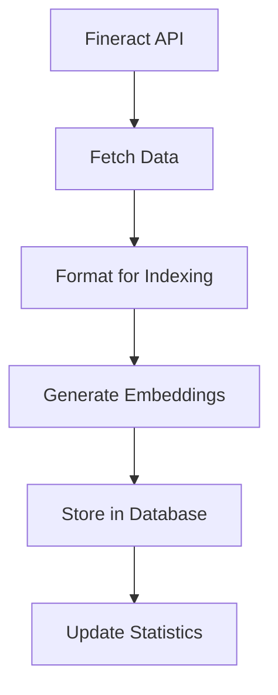
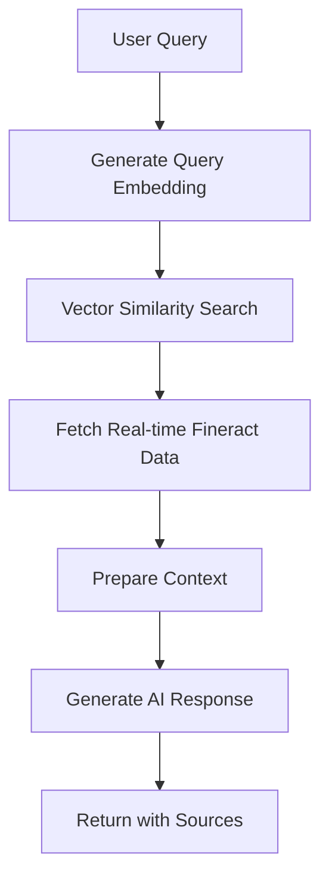

# RAG Implementation for Fineract Integration

This document describes the implementation of Retrieval-Augmented Generation (RAG) system that integrates with Apache Fineract to provide intelligent chatbot capabilities for the loan management system.

## Overview

The RAG system enables users to query Fineract data using natural language through an AI-powered chatbot interface. It combines real-time data retrieval from Fineract APIs with vector-based document search and OpenAI's GPT models to provide accurate, contextual responses.

## Architecture

### Components

1. **Fineract API Service** (`lib/fineract-api.ts`)
   - Handles communication with Apache Fineract
   - Provides typed interfaces for Fineract entities
   - Includes error handling and authentication

2. **RAG Service** (`lib/rag-service.ts`)
   - Manages document indexing and embedding generation
   - Performs vector similarity search
   - Orchestrates AI response generation

3. **Background Jobs** (`lib/background-jobs.ts`)
   - Automated data indexing every 6 hours
   - Cache cleanup and health monitoring
   - Graceful shutdown handling

4. **API Endpoints**
   - `/api/rag/query` - Process user queries
   - `/api/rag/index` - Trigger manual indexing and get stats

5. **Admin Dashboard** (`app/(application)/rag-admin/page.tsx`)
   - Monitor indexing progress
   - View system statistics
   - Manual indexing controls

6. **AI Assistant Component** (`components/ai-assistant.tsx`)
   - User interface for chatbot interactions
   - Context-aware suggestions
   - Source citation display

## Database Schema

### RAG-Related Tables

```sql
-- Document storage with embeddings
FineractDocument {
  id: String (CUID)
  title: String
  content: String
  documentType: String  -- "client", "loan", "loan_product"
  fineractId: String?   -- Reference to Fineract entity
  metadata: Json?
  embedding: String?    -- Vector embedding as JSON string
  createdAt: DateTime
  updatedAt: DateTime
}

-- Cached Fineract data
FineractDataCache {
  id: String (CUID)
  endpoint: String
  entityId: String?
  data: Json
  embedding: String?
  lastUpdated: DateTime
  expiresAt: DateTime
}

-- Chat session management
ChatSession {
  id: String (CUID)
  userId: String
  sessionData: Json?
  createdAt: DateTime
  updatedAt: DateTime
  messages: ChatMessage[]
}

-- Individual chat messages
ChatMessage {
  id: String (CUID)
  sessionId: String
  role: String          -- "user" or "assistant"
  content: String
  fineractData: Json?   -- Referenced Fineract data
  sources: Json?        -- Source documents used
  createdAt: DateTime
}

-- Query analytics
QueryLog {
  id: String (CUID)
  userId: String
  userQuery: String
  fineractDataUsed: Json?
  response: String
  responseTime: Int     -- Response time in milliseconds
  timestamp: DateTime
}
```

## Data Flow

### 1. Data Indexing Process



1. **Data Retrieval**: Fetch clients, loans, and loan products from Fineract
2. **Content Formatting**: Convert structured data to searchable text
3. **Embedding Generation**: Create vector embeddings using OpenAI's text-embedding-ada-002
4. **Storage**: Save documents and embeddings to PostgreSQL
5. **Indexing**: Create database indexes for efficient retrieval

### 2. Query Processing



1. **Query Embedding**: Convert user query to vector representation
2. **Similarity Search**: Find relevant documents using cosine similarity
3. **Real-time Data**: Fetch current Fineract data based on query intent
4. **Context Preparation**: Combine search results and real-time data
5. **AI Generation**: Use GPT-4 to generate contextual response
6. **Source Citation**: Include references to source documents

## Configuration

### Environment Variables

```bash
# OpenAI Configuration
OPENAI_API_KEY="your-openai-api-key-here"

# Fineract Configuration
FINERACT_BASE_URL="https://demo.fineract.dev"
FINERACT_USERNAME="mifos"
FINERACT_PASSWORD="password"
FINERACT_TENANT_ID="default"

# Background Jobs (optional in development)
ENABLE_BACKGROUND_JOBS="true"
```

### System Parameters

- **Similarity Threshold**: 0.7 (documents below this threshold are filtered out)
- **Max Results**: 5 (maximum number of source documents returned)
- **Embedding Model**: text-embedding-ada-002
- **Chat Model**: GPT-4
- **Auto-Index Interval**: 6 hours
- **Cache Cleanup**: Every hour
- **Health Check**: Every 30 minutes

## Usage

### 1. Initial Setup

```bash
# Install dependencies
pnpm install

# Set up environment variables
cp .env.example .env
# Edit .env with your API keys

# Run database migrations
npx prisma migrate dev

# Generate Prisma client
npx prisma generate
```

### 2. Manual Indexing

```bash
# Via API
curl -X POST http://localhost:3000/api/rag/index

# Via Admin Dashboard
# Navigate to /rag-admin and click "Index Now"
```

### 3. Querying the System

```javascript
// Via API
const response = await fetch('/api/rag/query', {
  method: 'POST',
  headers: { 'Content-Type': 'application/json' },
  body: JSON.stringify({ query: 'Show me overdue loans' })
});

// Via AI Assistant Component
// Use the floating chat button in the UI
```

## Supported Query Types

### Client Queries
- "Show me active clients"
- "Find clients with overdue loans"
- "What are the KYC requirements?"

### Loan Queries
- "List all overdue loans"
- "What loan products are available?"
- "Show loan portfolio summary"

### Product Queries
- "What are the current interest rates?"
- "Explain loan product features"
- "Compare loan products"

### Analytical Queries
- "Generate portfolio report"
- "Show risk assessment metrics"
- "What's the collection performance?"

## Performance Considerations

### Indexing Performance
- **Batch Processing**: Documents are processed in batches to avoid API rate limits
- **Incremental Updates**: Only changed documents are re-indexed
- **Background Processing**: Indexing runs in background jobs to avoid blocking user requests

### Query Performance
- **Vector Indexing**: Database indexes on embedding similarity
- **Caching**: Frequently accessed Fineract data is cached
- **Similarity Threshold**: Filters out irrelevant documents early

### Scalability
- **Horizontal Scaling**: Stateless design allows multiple instances
- **Database Optimization**: Proper indexing and query optimization
- **Rate Limiting**: Respects OpenAI and Fineract API limits

## Monitoring and Maintenance

### Health Checks
- Fineract API connectivity
- OpenAI API availability
- Database connection status
- Background job status

### Metrics
- Query response times
- Indexing progress
- Cache hit rates
- Error rates

### Maintenance Tasks
- Regular cache cleanup
- Embedding regeneration for updated documents
- Query log analysis
- Performance optimization

## Security Considerations

### Data Protection
- Sensitive data is not stored in embeddings
- API keys are stored securely in environment variables
- User queries are logged for analytics but can be anonymized

### Access Control
- Authentication required for all API endpoints
- Role-based access to admin functions
- Audit logging for administrative actions

### API Security
- Rate limiting on query endpoints
- Input validation and sanitization
- HTTPS enforcement in production

## Troubleshooting

### Common Issues

1. **Indexing Failures**
   - Check Fineract API connectivity
   - Verify OpenAI API key validity
   - Review database connection

2. **Poor Query Results**
   - Adjust similarity threshold
   - Re-index documents
   - Check query formatting

3. **Performance Issues**
   - Monitor database query performance
   - Check OpenAI API rate limits
   - Review caching effectiveness

### Debug Commands

```bash
# Check indexing stats
curl http://localhost:3000/api/rag/index

# Test Fineract connection
# Check logs for health check results

# Monitor background jobs
# Check console logs for job status
```

## Future Enhancements

### Planned Features
1. **Multi-language Support**: Support for queries in multiple languages
2. **Advanced Analytics**: More sophisticated query analysis and routing
3. **Custom Embeddings**: Fine-tuned embeddings for financial domain
4. **Real-time Updates**: WebSocket-based real-time data updates
5. **Voice Interface**: Speech-to-text query input
6. **Export Capabilities**: Export query results to various formats

### Technical Improvements
1. **Vector Database**: Migration to specialized vector database (e.g., Pinecone, Weaviate)
2. **Streaming Responses**: Real-time response streaming for better UX
3. **Advanced Caching**: Redis-based distributed caching
4. **Microservices**: Split into dedicated microservices for better scalability
5. **GraphQL Integration**: GraphQL API for more flexible data access

## Contributing

### Development Setup
1. Fork the repository
2. Create a feature branch
3. Implement changes with tests
4. Submit pull request

### Code Standards
- TypeScript for type safety
- ESLint and Prettier for code formatting
- Comprehensive error handling
- Unit and integration tests

### Testing
```bash
# Run tests
npm test

# Run type checking
npm run type-check

# Run linting
npm run lint
```

## License

This implementation is part of the KENAC Loan Matrix system and follows the project's licensing terms.
