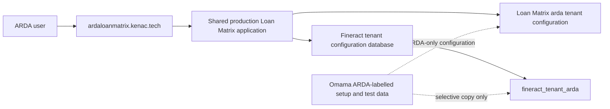

# ARDA Shared Tenant Design

## Purpose

Run ARDA as a separately configured tenant of the shared production Loan Matrix application, rather than as a dedicated application deployment. ARDA remains isolated from Omama in both Loan Matrix and Fineract while retaining the public address `ardaloanmatrix.kenac.tech`.

## Scope

This work covers:

- Routing `ardaloanmatrix.kenac.tech` to the existing production Loan Matrix application.
- Creating and configuring the Loan Matrix tenant with slug `arda`.
- Creating a dedicated Fineract tenant called `arda`, backed by its own tenant database and registered in the Fineract tenant-configuration database.
- Selectively copying ARDA-labelled configuration and controlled test records from Omama.
- Retiring the separate ARDA deployment only after validation succeeds.

This work does not copy Omama operational data, including real borrowers, live loans, repayments, journals, or user accounts.

## Architecture

The public hostname is mapped to the Loan Matrix tenant slug `arda`. Every Loan Matrix read and write is scoped to the ARDA tenant ID. Fineract calls from the ARDA hostname use the Fineract tenant ID `arda`; they must never fall back to `omama`.

## Loan Matrix Tenant Provisioning

Create an active `Tenant` record in `loan_matrix_prod` with:

- `name`: `ARDA`
- `slug`: `arda`
- `domain`: `ardaloanmatrix.kenac.tech`
- ARDA-only settings and feature flags

Provision tenant-scoped configuration for the new tenant:

- Pipeline stages, transitions, teams, and service-level settings.
- ARDA inventory items, balances, movement history where it is a controlled test record, and finance configuration.
- ARDA contract and mandate templates.
- Required documents, validation rules, branch access, and user role mappings needed for ARDA testing.
- ARDA products and payment configuration mappings.

Omama-specific contracts, branding, pipeline definitions, and data must not be used by ARDA.

## Fineract Tenant Provisioning

Create `fineract_tenant_arda` and register tenant ID `arda` in the Fineract tenant-configuration database, following the existing Fineract tenant pattern.

The new tenant receives only the configuration necessary for ARDA:

- Offices required for ARDA testing.
- ARDA-labelled loan products and payment types, including the in-kind stock-disbursement payment type.
- Supporting reference configuration needed by those products.
- Controlled ARDA-labelled test clients, leads, and loans where required to test the workflow.

Do not copy:

- Omama operational clients or production borrower information.
- Omama loans, repayments, accounting journals, tellers, cashiers, users, passwords, or authentication history.
- Omama tenant-specific documents, contracts, or branding.

## Selective Copy Controls

The copy process is read-only against Omama until a reviewed selection list is produced. The selection list must use ARDA naming and labels and include source and destination counts for every copied record type.

Before importing data:

1. Verify the destination Fineract tenant is registered and empty of operational records.
2. Produce a dry-run report of the proposed ARDA-labelled source records.
3. Confirm no unlabelled Omama operational records are included.

After importing data:

1. Compare source and destination counts for the approved record types.
2. Confirm all destination records belong to `arda` in Fineract and to the ARDA Tenant ID in Loan Matrix.
3. Confirm no application route can display Omama content when accessed through the ARDA hostname.

## Deployment And Routing

The production GitOps configuration for the existing Loan Matrix application receives `ardaloanmatrix.kenac.tech` in its gateway and virtual-service host lists. The shared production application remains otherwise unchanged.

The dedicated ARDA GitOps application is not removed until the shared route, Loan Matrix tenant, and Fineract tenant have passed validation. Its removal is then a separate, reversible GitOps change.

## Error Handling

- If hostname resolution does not find the ARDA tenant, the request fails clearly; it must not use Omama as a fallback.
- If Fineract tenant `arda` is unavailable, Loan Matrix displays a connection failure and does not retry against Omama.
- Copy failures leave Omama untouched and can be retried after correcting the destination tenant.
- A rollback removes the ARDA host from the shared route and leaves the former dedicated deployment available until retirement is explicitly completed.

## Acceptance Tests

1. Opening `ardaloanmatrix.kenac.tech` resolves the ARDA tenant.
2. ARDA login and application data load from the shared production application.
3. ARDA lead, inventory, approval, reservation, disbursement, and repayment flows use only Fineract tenant `arda`.
4. ARDA contract and mandate previews contain ARDA content only.
5. Omama users and data do not appear in ARDA, and ARDA records do not appear in Omama.
6. A deliberately invalid ARDA Fineract connection produces an error instead of accessing Omama.
7. After validation, the dedicated ARDA deployment can be removed without affecting the ARDA hostname.

## Rollout Order

1. Create and register the Fineract `arda` tenant and database.
2. Copy approved ARDA-only Fineract setup and controlled test records.
3. Create and configure the Loan Matrix `arda` tenant.
4. Add the ARDA hostname to the shared production route.
5. Validate the acceptance tests.
6. Retire the dedicated ARDA deployment in a separate GitOps change.
