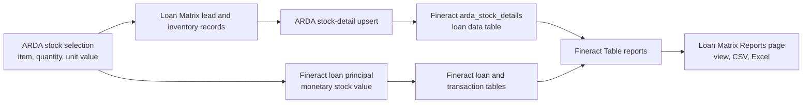

# ARDA Fineract Stock Reports Design

**Date:** 2026-10-09

## Purpose

Give ARDA finance and operations users detailed stock disbursement, repayment, and stock-item performance reports on the existing Loan Matrix Reports page. The reports must be standard Fineract Table reports, support the normal CSV and Excel exports, and remain isolated to the Fineract tenant `arda`.

## Current State

ARDA stock loan selection already calculates:

```text
stock value = quantity × unit value
```

Loan Matrix submits that stock value to Fineract as the loan principal. Fineract can therefore report the monetary stock value from the disbursement and principal fields without reading the Loan Matrix database.

The stock item, quantity, unit of measure, and unit value are currently stored only in Loan Matrix lead metadata and inventory records. The ARDA Fineract tenant has no loan-level data table containing those fields. Its loan products represent repayment terms such as `1 month` and `6 month`, rather than stock items.

The current production data confirms the monetary mapping:

- one ARDA Fineract loan has a USD 250.00 disbursement;
- the same loan has a USD 100.00 repayment;
- the post-repayment loan balance is USD 155.00 after principal and interest allocation;
- the production Loan Matrix ARDA tenant currently has no local stock issues or repayments to backfill.

An existing summary report named `ARDA Disbursements by Month` will remain unchanged. The new reports add transaction-level auditability and item-level performance.

## Scope

This work includes:

1. An ARDA-only Fineract loan data table for stock details.
2. Idempotent synchronization of approved ARDA stock details from Loan Matrix to the Fineract loan.
3. Three standard Fineract Table reports displayed on the existing Reports page.
4. Standard date, office, currency, product, and stock-item filters.
5. CSV and Excel export through the existing report UI.
6. A backfill path for ARDA stock issues that have a Fineract loan ID.

This work does not:

- add the data table or reports to Goodfellow, Omama, or any other tenant;
- replace Fineract as the source of loan disbursements and repayments;
- infer missing historical stock item names or quantities;
- change ARDA accounting entries, repayment allocation, loan schedules, or inventory valuation rules;
- remove or rename existing ARDA reports.

## Architecture



The Reports page remains generic. It obtains the report list, parameter metadata, parameter options, and report results from the existing `/api/fineract/reports` proxy. Creating the reports in tenant `arda` makes them available through the same flow used by Goodfellow without adding report-specific rendering code.

## Fineract Stock Details Data Table

Register a single-row Fineract data table named `arda_stock_details` against `m_loan` in tenant `arda`.

| Column | Fineract type | Required | Meaning |
| --- | --- | --- | --- |
| `stock_item_id` | String(100) | Yes | Stable Loan Matrix inventory item ID |
| `stock_item_name` | String(200) | Yes | Item name shown in reports |
| `quantity` | Decimal | Yes | Approved quantity issued on credit |
| `unit_of_measure` | String(50) | Yes | Bag, kilogram, unit, or configured measure |
| `unit_value` | Decimal | Yes | Approved value per unit |
| `total_stock_value` | Decimal | Yes | Server-calculated quantity multiplied by unit value |
| `currency_code` | String(10) | Yes | Currency used for value fields |
| `stock_issue_reference` | String(150) | No | Loan Matrix stock issue or lead reference |

Fineract supplies the loan link through the data table's `m_loan_id` key. The table is not multi-row: one loan has one approved stock selection.

### Synchronization Rules

Loan Matrix will expose a focused ARDA stock-detail service with two responsibilities:

1. ensure the ARDA Fineract data table exists;
2. upsert one loan's approved stock details.

The upsert will:

- run only when both the application tenant and resolved Fineract tenant are `arda`;
- calculate `total_stock_value` again on the server;
- reject missing or non-positive quantity and unit value;
- create the row when absent and update the existing row when present;
- use service authentication and the resolved ARDA Fineract tenant;
- treat the Fineract loan ID as the idempotency boundary.

Loan Matrix performs an initial upsert after Fineract loan creation and a required upsert immediately before disbursement. The pre-disbursement check uses the final approved stock selection. If it fails, disbursement stops before the external Fineract action runs. This ensures every newly disbursed ARDA stock loan has reportable stock metadata.

A backfill command will read ARDA `StockLoanIssue` and `StockLoanIssueLine` records with a Fineract loan ID and invoke the same upsert service. It will produce preview and apply modes, source counts, success counts, skip counts, and errors. It will not invent details for loans with no local source record.

## Report Parameters

All reports use existing Fineract parameters where available:

- start date;
- end date;
- office;
- currency;
- loan product.

Add an ARDA-only `Stock Item` select-all parameter. Its options query reads distinct item IDs and names from `arda_stock_details`, restricted to loans visible under the current user's office hierarchy. `All` is the default.

Fineract's Reports API attaches existing parameter IDs to a report but does not create a new reusable parameter definition. The setup therefore registers the `Stock Item` definition idempotently in the ARDA Fineract report-parameter catalog, records its resolved ID, and then creates or updates each report through the Reports API. This tenant configuration is part of the deployment routine and must run only against the resolved `arda` database.

Parameter semantics are:

- disbursement reports filter by disbursement transaction date;
- repayment reports filter by repayment transaction date;
- monthly performance groups the filtered disbursement dates by calendar month;
- an office includes that office and all descendant offices visible to the current user;
- a product means the Fineract loan product or repayment term;
- a stock item means the item stored in `arda_stock_details`.

## Report 1: ARDA Stock Disbursement Report

This report contains one row per unreversed disbursement transaction.

Columns:

- disbursement date;
- branch;
- borrower name;
- client account;
- loan account;
- loan product or repayment term;
- stock item, falling back to `Not captured` for historical loans;
- quantity and unit of measure;
- unit value;
- stock value, using the data-table value and falling back to the Fineract disbursement amount;
- amount repaid to date;
- outstanding loan balance;
- currency;
- loan status.

Reversed disbursements are excluded. Monetary fields come from Fineract loan and transaction tables. Item-level fields come from `arda_stock_details`.

## Report 2: ARDA Stock Repayment Report

This report contains one row per unreversed repayment transaction.

Columns:

- repayment date;
- Fineract transaction ID;
- branch;
- borrower name;
- client and loan accounts;
- loan product;
- stock item, falling back to `Not captured`;
- original quantity and unit of measure;
- original stock value, using the data-table value and falling back to principal disbursed;
- repayment amount;
- principal, interest, fee, and penalty portions;
- payment type;
- outstanding balance after the repayment;
- currency;
- user who recorded the transaction.

Reversed repayments are excluded. Each row keeps the original stock context alongside the money received so finance can reconcile cash collections to stock issued.

## Report 3: ARDA Stock Item Performance

This report aggregates unreversed disbursements by calendar month and stock item.

Columns:

- month;
- stock item;
- unit of measure;
- number of disbursements;
- total quantity issued;
- total stock value;
- average unit value;
- average stock value per disbursement;
- monthly rank based on total quantity issued.

Ranking uses `DENSE_RANK` within each month. Rows without captured item details are grouped under `Not captured` and do not receive a best-selling item rank. This keeps the historical monetary totals visible without presenting unknown inventory as a real item.

## Failure Handling

- Data-table registration is idempotent and ignores only the explicit already-exists response.
- Loan creation does not attempt to delete a successfully created Fineract loan if the initial metadata upsert fails. It records and surfaces the sync failure so the required pre-disbursement check can repair it.
- Disbursement stops when approved stock details cannot be synchronized.
- A mismatch between calculated total value and the saved total is rejected rather than silently copied.
- Report setup updates a matching ARDA report by name and creates it when absent.
- Report setup never switches tenant IDs after an error.
- Missing historical item details remain `Not captured`; no names, quantities, or unit values are fabricated.

## Permissions and Tenant Isolation

The setup routine must resolve tenant `arda` explicitly before registering the data table, custom parameter, or reports. Tenant slug checks are performed in both the synchronization caller and service.

Validation must confirm:

- all three reports exist only in Fineract tenant `arda`;
- `arda_stock_details` exists only in Fineract tenant `arda`;
- report permissions are available to the intended ARDA roles;
- Goodfellow report definitions and parameter catalogs are unchanged;
- another tenant cannot read an ARDA stock-detail row by passing an ARDA loan ID.

## Validation Strategy

Implementation follows test-first development.

### Unit and service tests

- stock value equals quantity multiplied by unit value;
- invalid quantity or unit value is rejected;
- repeated upsert updates one data-table row and does not duplicate it;
- non-ARDA tenants cannot register or write the data table;
- loan creation submits the initial stock-detail upsert;
- pre-disbursement validation requires a successful final upsert;
- a failed upsert prevents the Fineract disbursement action;
- backfill preview does not write and apply mode uses the shared upsert service.

### Fineract report validation

- each report appears on the ARDA Reports page;
- parameter metadata and option lists load successfully;
- office hierarchy, date, currency, product, and stock-item filters work individually and together;
- reversed transactions are absent;
- the disbursement report's stock value matches the Fineract disbursement amount and synced stock total;
- repayment allocations and post-transaction balances match the source transactions;
- monthly disbursement count, quantity, value, averages, and rank match independently calculated totals;
- CSV and Excel exports contain the same columns and row counts as the displayed report;
- Goodfellow and at least one additional tenant have none of the ARDA artifacts.

Production currently lacks a complete item-level record suitable for live validation. SQL compilation and item aggregation will be validated with transactionally inserted test data that is rolled back. The existing ARDA demonstration loan validates the monetary fallbacks without fabricating an item or quantity.

## Rollout

1. Add and test the tenant-gated stock-detail synchronization code.
2. Register `arda_stock_details` in the ARDA Fineract tenant.
3. Register the ARDA stock-item definition in the ARDA Fineract parameter catalog and resolve its ID.
4. Create or update the three reports through the Fineract Reports API.
5. Deploy Loan Matrix synchronization.
6. Run the backfill preview, then apply it if eligible local records exist.
7. Verify the Reports page, permissions, filters, values, and exports.
8. Verify other tenants are unchanged.

Rollback disables the ARDA synchronization caller and removes the three report definitions from tenant `arda`. The data-table row is retained unless an explicit cleanup is approved, because it is audit metadata and does not alter loan accounting.

## Additional Report Backlog

The following reports are useful follow-ups but are not part of this implementation:

1. Outstanding stock recovery and arrears aging.
2. Collection rate by stock item and branch.
3. Stock-loan profitability from interest and fees.
4. Stock value issued versus money repaid by month.
5. ARDA loans missing stock details.
6. Stock-item demand forecasting from monthly issue history.
7. Physical inventory versus issued-stock reconciliation. This requires Fineract access to Loan Matrix inventory balances or a separate reconciliation report in Loan Matrix.

## Acceptance Criteria

1. ARDA users can open all three reports from the existing Reports page.
2. Disbursement and repayment reports include monetary stock value for existing and future loans.
3. New ARDA stock loans include item, quantity, unit, and unit-value details in Fineract before disbursement.
4. Monthly performance shows disbursement count, quantity, value, averages, and best-selling rank per item.
5. All filters and exports operate through the existing Fineract report API flow.
6. Repeated synchronization and setup are idempotent.
7. A stock metadata synchronization failure prevents disbursement.
8. Missing historical details are displayed as `Not captured` and never invented.
9. No other tenant receives ARDA tables, parameters, reports, or workflow behavior.
